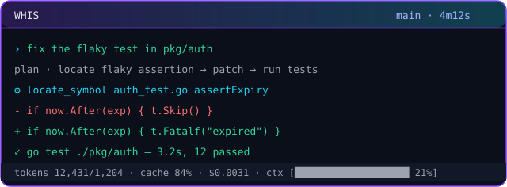

<div align="center">




[](https://go.dev)
[](LICENSE)
[](https://github.com/NamanGaonkar/WHIS---CLi-coder/releases)

**Hyper-lean, token-surgical AI coding CLI with an overkill ember-on-black TUI.**
BYO key. Local via Ollama or remote: DeepSeek · Anthropic · OpenAI · OpenRouter.

`whis` → type → ship. No setup wizard in your way.

</div>

---

## Install

**Windows / macOS / Linux — grab a static binary** (recommended, always current):

Download `whis-windows-amd64.exe` (or your platform) from
[Releases](https://github.com/NamanGaonkar/WHIS---CLi-coder/releases) and put it
on your `PATH`. No runtime deps, no CGO.

**Build from source:**

```sh
git clone https://github.com/NamanGaonkar/WHIS---CLi-coder && cd WHIS---CLi-coder
go build -o whis ./cmd/whis
```

**Optional — real headless browser** (JS-rendered pages, bot-walled sites,
verifying a live dev server):

```sh
whis browser-install   # one-time ~90 MB Chromium download
```

## How it works

Start `whis` in any folder. You land on the splash with an input — that's it.
No config gate, no boot errors, no forced wizard.

**Type `/` and the command menu appears below the input box** (mouse-clickable):

```
 > mode        plan · ask · auto (how the agent acts)
   model       switch provider or model
   provider    manage API keys & providers
   sessions    resume a session from this folder
   task        run an isolated subagent task
   themes      switch the TUI color palette
   ...
```

**model** → pick a **provider** first (Ollama local, Ollama Cloud, DeepSeek,
Anthropic, OpenAI, OpenRouter). Local providers list their installed models
automatically; cloud providers ask for a key inline the first time (masked
input, saved to `~/.whis/config.json`).

**provider** → add **or re-enter/edit** any provider key at any time — the
menu shows a masked fingerprint of what you're replacing.

**themes** → ember (default), dim, mono. Also `?` or `ctrl+t`.

## Usage

```sh
whis                    # full TUI in the current project
whis -m <model>         # skip the picker, bind a model up front
whis -p "fix the failing tests in pkg/x" -y   # headless one-shot, auto-approve
whis -r 20260926-153012 # resume a saved session (whis -l to list)
whis browser-install    # one-time Chromium download for the browser tool
whis -undo              # roll back to the last whis snapshot
whis -init              # generate WHIS.md project guide
```

## The Token-Surgical Engine

| Tool | What it does |
|---|---|
| `web_search` | live web search — current events, fresh facts, never answered from stale memory |
| `web_fetch` | any public page → clean readable text (browser headers, challenge detection, reader fallback) |
| `browser` | real headless Chromium: navigate / click / get_text / screenshot — JS sites and bot-walls that block plain HTTP |
| `locate_symbol` | extracts a function/type body via the symbol index — never whole files |
| `read_range` | numbered line slices; reads >120 lines are blocked unless forced |
| `apply_patch` | SEARCH/REPLACE edits with a **Levenshtein fuzzy applicator** (tolerates nearby-line drift) |
| `run_command` | sandboxed shell in workspace root, output capped at 40 lines, hard timeout |
| `search_codebase` | regex → `file:line` anchors |
| `list_tree` | pruned tree (skips `.git`, `node_modules`, `.venv`, …) |

The agent loop carries an **anti-repeat guard** (identical repeated tool calls
get a cached result plus a STOP instruction — no endless loops) and a
**FRESHNESS directive** (time-sensitive questions go to `web_search` first,
never memory).

**Prompt cache discipline:** the system prompt, WHIS.md guide and tool
manifests stay byte-identical across turns; Anthropic blocks carry
`cache_control: {"type":"ephemeral"}` and DeepSeek gets a maximally stable
prefix — expect >80% cache-hit rates on multi-turn sessions.

**Micro-compaction:** when estimated context crosses 60% of the model window,
stale tool logs are squashed into 2-line diagnostic vectors automatically.

## Agent loop & safety

Prompt → Plan → Tool invocation → Diff review → Terminal verification.

- Shell commands and file writes open an approval modal (`y/n/esc`);
  destructive commands always prompt, even in auto mode
- `--auto-approve` / `-y` for unattended runs
- `/undo` rolls back instantly (git shadow commits when in a repo, file
  snapshots in `~/.whis/undo` otherwise) — zero LLM tokens burned
- `/task "…"` runs a context-isolated subagent; only its final summary
  reaches the main session
- Sessions auto-snapshot to `~/.whis/sessions/` for pause/resume
- `browser` never touches loopback/LAN addresses (SSRF-safe), and the lazy
  Chromium launch fails with a helpful `whis browser-install` hint instead of
  crashing the session

## WHIS.md

`whis -init` (or `/init` in-session) inspects project markers
(`go.mod`, `package.json`, `Cargo.toml`, `pyproject.toml`, …) and writes a
project guide with build/test commands that WHIS pins into its cached system
prompt every session.

## Development

```sh
git clone https://github.com/NamanGaonkar/WHIS---CLi-coder && cd WHIS---CLi-coder
make build   # → ./whis
make test vet
make release # cross-compiled artifacts in dist/
```

Go 1.23+, zero CGO — `GOOS/GOARCH` cross-compiles anywhere.

## License

MIT © WHIS contributors
