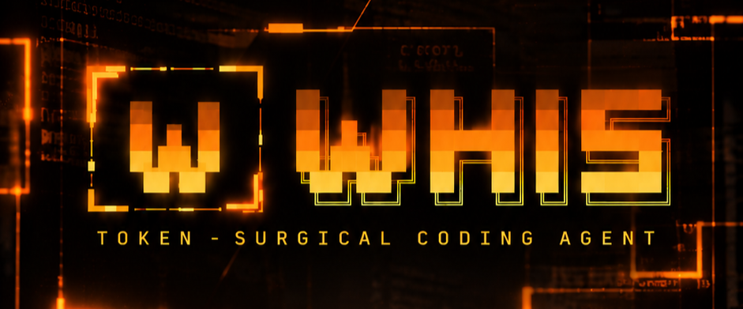

<div align="center">




[](https://go.dev)
[](LICENSE)
[](https://github.com/NamanGaonkar/WHIS---CLi-coder/releases/latest)
[](https://github.com/NamanGaonkar/WHIS---CLi-coder/releases/latest)

**Hyper-lean, token-surgical AI coding CLI with an overkill ember-on-black TUI.**
BYO key. Local via Ollama or remote: DeepSeek · Anthropic · OpenAI · OpenRouter · Gemini · xAI · Mistral · Moonshot · Qwen · Z.ai · MiniMax · Groq.

`whis` → type → ship. No setup wizard in your way.

</div>

---

## Install

**One command. Any machine.** (Windows PowerShell / macOS / Linux)

```powershell
iwr https://raw.githubusercontent.com/NamanGaonkar/WHIS---CLi-coder/main/install.ps1 | iex
```

```sh
curl -fsSL https://raw.githubusercontent.com/NamanGaonkar/WHIS---CLi-coder/main/install.sh | sh
```

The right binary for your OS & CPU is picked automatically, **sha256-verified**,
installed to a user bin dir, and PATH is set up for you. No Go, no sudo, no deps.

Already installed? **`whis update`** moves you to the latest release.

**Direct download** (if you prefer): grab `whis-windows-amd64.exe` (or your
platform) from [Releases](https://github.com/NamanGaonkar/WHIS---CLi-coder/releases/latest)
and put it on your `PATH`. Static binary, no runtime deps, no CGO.

**Optional — real headless browser** (JS-rendered pages, bot-walled sites,
verifying a live dev server):

```sh
whis browser-install   # one-time ~90 MB Chromium download
```

## How it works

Start `whis` in any folder. You land on the splash with an input — that's it.
No config gate, no boot errors, no forced wizard.

**Type `/` and the command menu appears below the input box** (mouse-clickable):

```
 > mode        plan · ask · auto (how the agent acts)
   model       switch provider or model
   provider    manage API keys & providers
   sessions    resume a session from this folder
   task        run an isolated subagent task
   copy        copy the last reply · /copy prompt|output
   mcp         connected MCP servers and their tools
   themes      switch the TUI color palette
   ...
```

**model** → pick a **provider** first (Ollama local, Ollama Cloud, DeepSeek,
Anthropic, OpenAI, OpenRouter, Gemini, xAI, Mistral, Moonshot, Qwen, Z.ai,
MiniMax, Groq). Local providers list their installed models automatically; cloud
providers fetch their live model list for your key and ask for the key inline
the first time (masked input, saved to `~/.whis/config.json`). Menus are
**type-to-search** — just start typing to filter.

**provider** → add **or re-enter/edit** any provider key at any time — the
menu shows a masked fingerprint of what you're replacing.

**themes** → ember (default), dim, mono. `ctrl+t` or `/themes`.

**keys** → `/` command menu · `ctrl+y` copy last reply · `ctrl+o` expand code
blocks · `pgup/pgdn` scroll chat · `esc` back / interrupt · `ctrl+c` quit.

## Usage

```sh
whis                    # full TUI in the current project
whis -m <model>         # skip the picker, bind a model up front
whis -p "fix the failing tests in pkg/x" -y   # headless one-shot, auto-approve
whis -r 20260926-153012 # resume a saved session (whis -l to list)
whis browser-install    # one-time Chromium download for the browser tool
whis -undo              # roll back to the last whis snapshot
whis -init              # generate WHIS.md project guide
whis mcp                # show connected MCP servers & tools
whis mcp add github     # one-command MCP server setup (see below)
```

## MCP — plug the outside world in

WHIS is a full **MCP (Model Context Protocol) host**. Connect community tool
servers — filesystem access, GitHub, SQLite, web fetch, anything — and their
tools appear next to WHIS's native ones as `server__tool`.

**One-command setup** (prompts for the single value it needs, merges the config):

```sh
whis mcp add filesystem   # expose a directory to the agent
whis mcp add github       # GitHub API (asks for a personal access token)
whis mcp add sqlite       # query/edit a SQLite database
whis mcp add brave        # Brave web search
whis mcp add fetch        # fetch/render web pages
```

Or edit `~/.whis/mcp.json` directly — **standard Claude/Cursor schema**, paste
your existing config verbatim:

```json
{
  "mcpServers": {
    "filesystem": {
      "command": "npx",
      "args": ["-y", "@modelcontextprotocol/server-filesystem", "C:/path/to/dir"]
    },
    "fetch": { "command": "uvx", "args": ["mcp-server-fetch"], "disabled": true }
  }
}
```

Restart whis. `/mcp` shows every server (● connected with tool count, ○
disabled, × failed) and its full tool list. MCP calls are **approval-gated**
like native tools, render with an amber `◆` marker in chat, and their output
is capped (200 lines / 20 KB) so a database dump can't blow your token budget.

**Token-surgery rules apply here too:** no config file = zero overhead (nothing
spawns, nothing added to the prompt). A dead server is one warning line — boot
is never blocked. `"disabled": true` parks a server at zero token cost. Servers
connect in the background with a 15 s budget, so slow starters like `npx`
can't stall the TUI. In plan mode MCP tools are denied (unknown side effects).

## The Token-Surgical Engine

| Tool | What it does |
|---|---|
| `web_search` | live web search — current events, fresh facts, never answered from stale memory |
| `web_fetch` | any public page → clean readable text (browser headers, challenge detection, reader fallback) |
| `browser` | real headless Chromium: navigate / click / get_text / screenshot — JS sites and bot-walls that block plain HTTP |
| `locate_symbol` | extracts a function/type body via the symbol index — never whole files |
| `read_range` | numbered line slices; reads >120 lines are blocked unless forced |
| `apply_patch` | SEARCH/REPLACE edits with a **Levenshtein fuzzy applicator** (tolerates nearby-line drift) |
| `multi_edit` | **batch several SEARCH/REPLACE edits across many files in ONE call** — one approval, one undo point, all-or-nothing (a missing search block writes nothing) |
| `run_command` | sandboxed shell in workspace root, output capped at 40 lines, hard timeout |
| `search_codebase` | regex → `file:line` anchors |
| `list_tree` | pruned tree (skips `.git`, `node_modules`, `.venv`, …) |
| `task_tracker` | the agent's persistent checklist (`.whis/tasks.md`) — written before multi-step jobs, updated as steps complete, injected into every turn so long jobs don't drift |
| `memory_save` / `memory_recall` / `memory_forget` | persistent cross-session memory (`~/.whis/memory.json`) |
| `server__tool` | any tool from a connected MCP server |

The agent loop carries an **anti-repeat guard** (identical repeated tool calls
get a cached result plus a STOP instruction — no endless loops), a
**FRESHNESS directive** (time-sensitive questions go to `web_search` first,
never memory), a **FINISH-THE-THOUGHT rule** (after tools the agent states the
outcome — a bare "Done." is not a reply) and **ANSWER FIRST** (ambiguous
requests get answered on the most reasonable reading, not interrogated).

**Prompt cache discipline:** the system prompt, WHIS.md guide and tool
manifests stay byte-identical across turns; Anthropic blocks carry
`cache_control: {"type":"ephemeral"}` and DeepSeek gets a maximally stable
prefix — expect >80% cache-hit rates on multi-turn sessions.

**Micro-compaction:** when estimated context crosses 60% of the model window,
stale tool logs are squashed into 2-line diagnostic vectors automatically.

## Agent loop & safety

Prompt → Plan → Tool invocation → Diff review → Terminal verification.

- Shell commands and file writes open an approval modal (`y/n/esc`);
  destructive commands always prompt, even in auto mode; MCP tool calls go
  through the same gate
- `--auto-approve` / `-y` for unattended runs
- **120-turn agent loop** (40 for subagents) for long multi-step jobs
- `/undo` rolls back instantly (git shadow commits when in a repo, file
  snapshots in `~/.whis/undo` otherwise) — zero LLM tokens burned
- `/task "…"` runs a context-isolated subagent; only its final summary
  reaches the main session (subagents inherit MCP tools)
- `/new` fresh conversation · `/retry` re-run the last prompt · `/compress`
  squash old tool logs · `/usage` tokens, cost & context
- `/copy` copies the last reply (raw markdown, not the rendered form);
  `/copy prompt` your last prompt; `/copy output` the last command output;
  `ctrl+y` for the quick path. Verified against the real system clipboard.
- Sessions auto-snapshot to `~/.whis/sessions/` (auto-titled after your first
  prompt) for pause/resume; `/sessions` lists them with task counts
- `browser` never touches loopback/LAN addresses (SSRF-safe), and the lazy
  Chromium launch fails with a helpful `whis browser-install` hint instead of
  crashing the session
- Single-instance device lock: a second whis on the same folder offers a
  polite takeover instead of corrupting sessions

## WHIS.md

`whis -init` (or `/init` in-session) inspects project markers
(`go.mod`, `package.json`, `Cargo.toml`, `pyproject.toml`, …) and writes a
project guide with build/test commands that WHIS pins into its cached system
prompt every session.

## License

MIT — see [LICENSE](LICENSE). Made by Naman Gaonkar.
